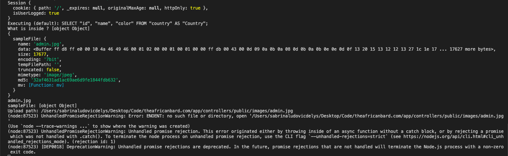
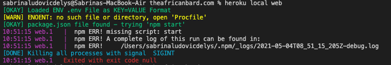
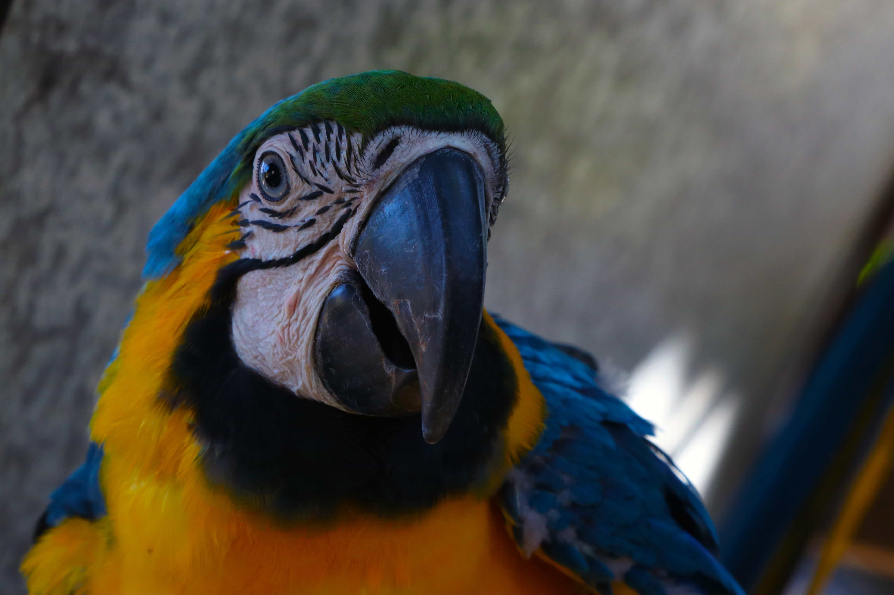
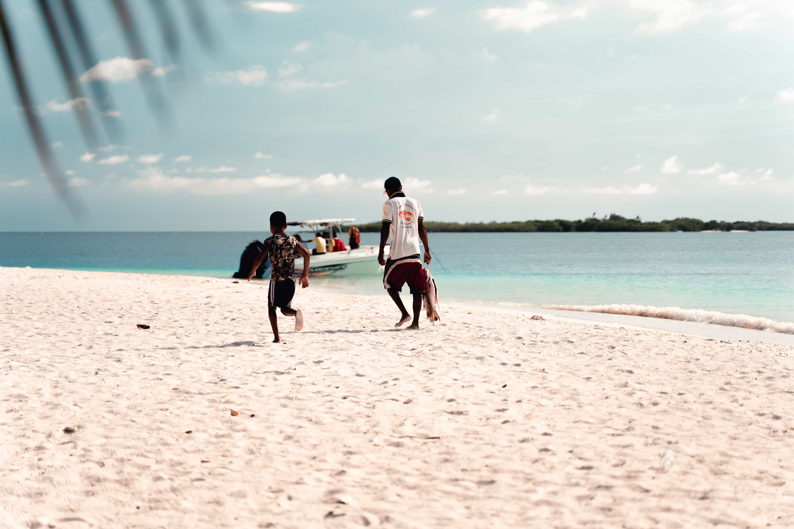
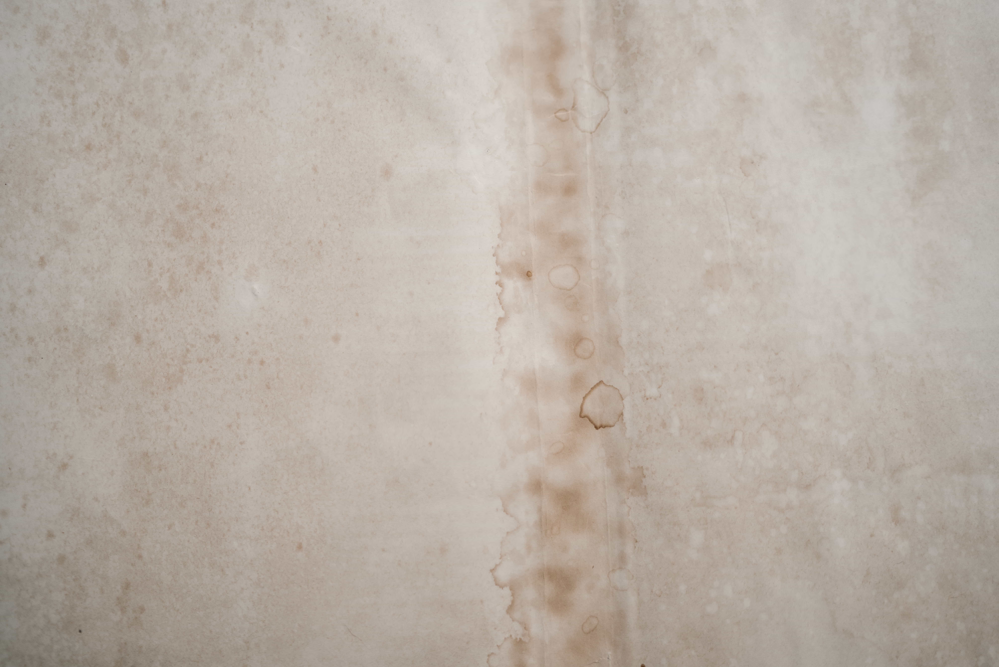
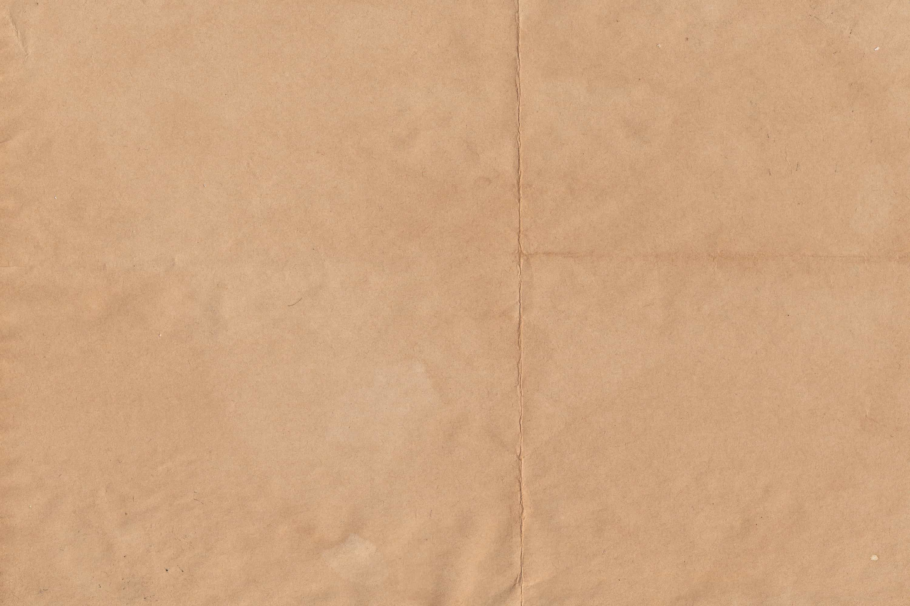

# Projet Travel Blog 

<!-- INDEX -->
<details open="open">
  <summary>Index</summary>
  <ol>
    <li><a href="#analyse-préliminaire">Analyse préliminaire </a></li>
    <li>
      <a href="#carnet-de-bord">Carnet de bord</a>
      <ul>
        <li><a href="#serveur">Serveur</a></li>
        <li><a href="#interface">Interface</a></li>
      </ul>
    </li>
    <li><a href="#les-images">Les images</a></li>
    <li><a href="#contact">Contact</a></li>
  </ol>
</details>

# Analyse préliminaire 

- une page web avec des articles de voyage 
- un administrateur qui peut se connecter 
- les visiteurs peuvent lire des articles 
- les visiteurs peuvent contacter l'auteur à l'aide d'un formulaire 
- l'administrateur peut ajouter un nouvel article
- un article possède une photo ou plusieurs photos
- un article possède un titre 
- un article possède une courte phrase détaillant un passage intéressant
- un article possède une description 
- un article possède une destination assignée 

- Bonus: Plusieurs 'auteurs' peuvent se connecter à leurs profil et ajouter ou supprimer un article 


# Carnet de bord

## A. Serveur
-------
### 1. Des images dans la BDD ?

_28 Mars 2021_

- Il est possible de stocker des images dans la BDD mais ce n'est pas une bonne pratique. 
Il faudrait plutôt stocker les images dans un dossier et les chemins vers ces images dans la base de données. 

- "Images can get quite large, greater than 1MB. And so storing images in a database can potentially put unnecessary load on your database and the network between your database and your web server if they're on different hosts".
[Stackoverflow](https://stackoverflow.com/questions/6472233/can-i-store-images-in-mysql)

- Les base de données d'aujourd'hui sont tout à fait capable de stocker de grandes images, mais je choisis de stocker les images enregistrées par l'administrateur dans un dossier images, qui sera ensuite ajouter a la base de données. 

### 2. Il y a beaucoup de textes dans ma requête SQL

_29 Mars 2021_

- J'aimerais pouvoir importer dans ma table un fichier qui contient le texte de mon blog. Écrire tout le texte dans ma requête SQL rends mon code illisible, ce qui n'est pas optimale. 

- Rien à faire, le fichier SQL n'est pas censé être 'beau'. Il faut que j'écrive tout les paragraphes de mes articles dans ma transaction SQL.

### 3. Pouvoir récupérer la colonne country_id dans ma requêtes des articles

_01 Avril 2021_

- Dans mon controller ```articleController``` je récupère tout mes articles sur la route ```'/articles'```, mais je ne récupère les pays auxquelles ils correspondent. 

- Mon object sequelize n'était pas bien configurer dans mon fichier ```database.js```. Il fallait que j'indique à sequelize plusieurs choses: 
    - ```timestamps:false``` afin de ne pas avoir la création automatique de ```createdAt``` et ```updatedAt``` pour tout mes models
    - Dans mon fichier ```article.js``` je configure mon  ```timestamps: true```, ```createdAt: 'created_at'```  et ```updatedAt: 'updated_at' ``` pour pouvoir avoir ces colonnes dans ma table 'article'. 
    - Dans mon fichier ```country.js ``` je configure mon timestamps, createdAt et updatedAt a ```false``` pour ne pas que sequelize ajoute directement ces colonnes et éviter les erreurs avec un status 500 dans ma requête.  
    
    

### 4. Récupérer un fichier en POST et l'ajouter dans mon dossier 'images'

_07 Avril 2021_

- Dans mon controller ```adminController``` j'ai configurer une méthode ```addArticle``` afin de pouvoir récupérer les données envoyer en POST de mon formulaire qui se trouve dans mon fichier ```addArticle.ejs```. 

- J'ai télécharger un npm package qui s'appelle ```express-fileupload``` et j'ai utiliser la fonction ```mv()``` pour: 
    - récupérer l'image qui se trouve dans ```request.files```
    - définir un chemin dans ```fileUpload``` vers le dossier souhaité 
    - enregistrer l'image dans le bon dossier ```'/public/images/mon-image.png/```

[GitHub express-fileupload](https://github.com/richardgirges/express-fileupload/tree/master/example#basic-file-upload)

- ERREUR: 


```(node:87604) UnhandledPromiseRejectionWarning: Error: ENOENT: no such file or directory, open '/Users/sabrinaludovicdelys/Desktop/Code/theafricanbard.com/app/controllers/public/images/admin.jpg'```

- Je n'avais pas configurer le bon chemin vers mon dossier 

- SOLUTION: 

```
uploadPath = '/Users/sabrinaludovicdelys/Desktop/Code/theafricanbard.com/public/images/' + sampleFile.name;
```

### 5. Un operateur Sequelize qui permet une requête SQL du type IN [1, 2]

_08 Avril 2021_

- Dans mon formulaire je récupère le titre, l'image, le text, et les id des pays associés à mon article. 
- Dans mon test, j'aimerais ajouter un article associé à plusieurs pays et stocker cette information dans ma BDD avec l'instance ```Article.create()```.
- Avec ```findByPk``` je peux récupérer un pays correspondant à un seul id
- J'aimerais récupérer plusieurs pays en faisant référance à plusieurs ids, avec une requête de ce type: 
```
SELECT * FROM country WHERE id IN (3,4);
```

- SOLUTION : [Sequelize Operators](https://sequelize.org/master/manual/model-querying-basics.html#operators)

```
 // Trouve tout les pays qui correspondent graçe à leurs id 

const countries = await Country.findAll({
where: {
id: { [Op.in]: infosArticle.countries }
}
});
```

### 6. Créer un nouvel article, puis l'associer à des pays existants dans la table 'country'

_11 Avril 2021_

- Après avoir récupérer un tableau de tout les pays que je souhaitais associer à mon article, j'ai utiliser la méthode Sequelize ```.create()``` pour pouvoir ajouter un nouvel article et en même temps associer ce nouvel article avec des pays. 

- Je me suis servie de la documentation de Sequelize qui concernent la création d'instance avec des association [Creating with Associations - BelongsToMany association](https://sequelize.org/master/manual/creating-with-associations.html). J'ai reçu une erreur de la part de mon programme. 

```
-ERROR: ERROR: duplicate key value violates unique constraint "country_pkey"
```

- Il se trouve que dans l'example de la documentation de Sequelize, il est indiqué que l'on peut créer une instance avec des associations en une seule étape uniquement si tout les éléments sont créer pour la première fois. Avec l'erreur mon programme m'indique que il ne peut pas ajouter un pays qui existe déjà. 

- SOLUTION: Étant donné que une association est définie entre mes deux modèles, les instances de ces modèles bénéficient de méthodes spéciales pour intéragir avec leurs homologues associés. [Special methods/mixins added to instances](https://sequelize.org/master/manual/assocs.html#special-methods-mixins-added-to-instances)

```
// Trouve tout les pays qui correspondent graçe à leurs id 
    const countries = await Country.findAll({
        where: {
            id: { [Op.in]: infosArticle.countries }
            }
        });

/* Etape 3: Création d'un nouvel article */

// Créer et ajouter un nouvel article à la base de données avec les informations de infosArticle + countries  
    const newArticle = await Article.create({
        title: infosArticle.title,
        image_path: infosArticle.image_path,
        text: infosArticle.text
        });

// Associer notre nouvel article aux pays sélectionnés dans notre formulaire
    await newArticle.addCountries(countries, {as: 'countries'});
```

### 7. Afficher les images sur GitHub 

_16 Avril 2021_

- En connectant le projet à mon compte GitHub, je me suis rendue compte que les images de mon fichier `README.md` ne s'affichaient pas. 
- Pour y remédier j'ai d'abord supprimer le fichier `README.md` qui a été créer automatiquement lors de la création du dépôt. 
- Après avoir tester toutes les astuces proposées sur [Stackoverflow](https://stackoverflow.com/questions/14494747/how-to-add-images-to-readme-md-on-github/53771381), je me suis demandée si j'avais bien indiquer à mon programme le bon chemin vers mes images. 
- En effet je n'avais pas indiquer que mon dossier `images` se trouvait lui même dans mon dossier `doc` qui se trouve à la racine de mon projet. 
``` 
./images/erreur500_sequelize.png 
 ``` 
 - De plus en observant mon erreur de plus près, j'indiquais à mon programme, avec la syntaxe `./` d'aller chercher mes images dans le dossier actuel du fichier sur lequel je travaille. Hors, mon fichier `README.md` se trouve à la racine de mon projet. 
 - Le bon chemin vers mes images est celui-ci: 
 ```
 doc/images/erreur500_sequelize.png
 ```

### 8. Sécuriser le mot de passe

_19 Avril 2021_ 

- Pour éviter qu'un autre programmeur puisse facilement avoir accès au mot de passe du compte administrateur, j'ai décider de stocker celui-ci dans mon fichier `.env`.

### 9. Éviter les injections malveillantes

_19 Avril 2021_ 

Afin de protéger mon application de la faille de sécurité ``Cross-Site Scripting`` inhérent aux formulaire HTML, j'ai mis en place un package [sanitizer](https://www.npmjs.com/package/sanitizer) qui me permet d'utiliser plusieurs méthodes pour assainir les données qui peuvent être fournies par l'utilisateur: 
  - les paramètres d'URL : request.params
  - les infos fournies dans l'URL : request.query
  - les infos reçues via un formulaire : request.body

-------
## B. Interface
-------

- Pour cette partie, j'ai commencer par la page d'accueil. Je voulais avoir quelque chose de fonctionnel avec une apparence esthétique élégante. 

- J'ai utiliser trois polices de caractères que j'ai récupérer sur [Google Fonts](https://fonts.google.com/).

- Pour la création du site en mode "responsive", je me suis aidée d'une documentation concernant le [Boostrap de Twitter](https://scotch.io/tutorials/default-sizes-for-twitter-bootstraps-media-queries).

### 10. La barre de navigation et le logo

_19 Avril 2021_ 

- J'avais du mal à me décider sur la stylisation du logo avec Canvas, alors je me suis contentée de choisir une police de caractère qui attirait l'oeil. 
- Je voulais que ma barre de navigation, ainsi que le logo de du site soit mis en valeur avec de l'animation. Je savais que cela était possible avec les propriétés `hover` et `transition-delay`, mais je ne savais pas par où commencer. 
- Je me suis aidée du code de Jegede Olamide que j'ai trouver sur [CodePen](https://codepen.io/jegedeolamide99/pen/MOqrZj).

### 11. Les articles et les pays 

_22 Avril 2021_ 

- Pour la page qui contient tout les articles ainsi que leur lecture, je me suis inspirée du site de [Emma Gannon](https://www.emmagannon.co.uk/blogger). 

- Pour les pages où il y avait moins d'informations à lire par l'utilisateur, j'ai préferer attirer l'attention de l'utilisateur avec une image de fond. 

- Je me suis aidée du guide flexbox sur le site [css.tricks.com](https://css-tricks.com/snippets/css/a-guide-to-flexbox/), ainsi que la documentation sur la propriété CSS position qui se trouve sur [MDN Web Docs](https://developer.mozilla.org/en-US/docs/Web/CSS/position) 

### 12. Se connecter, supprimer un article, ajouter un article 

_26 Avril 2021_ 

- La propriété CSS [`overflow`](https://developer.mozilla.org/en-US/docs/Web/CSS/overflow) m'a été utile lorsque j'ai remarquer que ma liste d'articles à supprimer, débordait et chevauchait mon bas de page. 

- J'ai utiliser la librairie de [Font Awesome](https://fontawesome.com) afin d'ajouter une icône représentant le bouton pour supprimer un article. 

-------

## C. Heroku 

### 13. Déploiement d'une application Node.js sur Heroku 

ERREUR:



SOLUTION:

- Afin de lancer mon application, Heroku a besoin d'un fichier Procfile. 
Lorsque celui-ci n'est pas présent il tente de lancer l'application avec la configuration ```start script``` qui se trouve dans le fichier ```package.json```.
Il fallait donc que je dise à Heroku d'executer mon application en ajoutant ceci dans ```package.json```
```
"scripts": {
    "start": "node index.js"
  },
```
[Documentation Déploiement en Node.js sur Heroku](https://devcenter.heroku.com/articles/deploying-nodejs). 

### 14. Configuration des variables d'environnement 

- Même si mon application se lance dans plusieurs environnement, il est important de noter que les configuration de ses environnements seront différentes. 
La configuration spécifique à l'environnement d'une application doit être stockée dans des variables d'environnement (et non dans le code source de l'application).
Il fallait que je configure les variables d'environnement nécessaire au lancement de mon application sur Heroku. 

 [Configuration et les variables d'environnements](https://devcenter.heroku.com/articles/config-vars).


# Les images 

<div>

<figcaption>Jordan Madrid</figcaption>
</div>

<div>

<figcaption>Adolfo Felix</figcaption>
</div>

<div>

<figcaption>Micah Williams</figcaption>
</div>

<div>

<figcaption>Freestocks</figcaption>
</div>

<div>

<figcaption>Patrick Fore</figcaption>
</div>

<div>

<figcaption>Patrick Tomasso</figcaption>
</div>

<div>

<figcaption>Jorge Salvador</figcaption>
</div>

<div>

<figcaption>Joppe Spaa</figcaption>
</div>

<div>

<figcaption>Jorge Salvador</figcaption>
</div>

<div>

<figcaption>Bruno Aguirre</figcaption>
</div>

<div>

<figcaption>Nick Fewings</figcaption>
</div>

<div>

<figcaption>Marcus Dall Col</figcaption>
</div>

<div>

<figcaption>Ali Diaz</figcaption>
</div>

<div>

<figcaption>Jorge Salvador</figcaption>
</div>

<div>

<figcaption>Annie Spratt</figcaption>
</div>

<div>

<figcaption>Ivan Gromov</figcaption>
</div>

<div>

<figcaption>Michael Dziedzic</figcaption>
</div>

-------

# Contact 

Sabrina Ludovic de Lys - [ludovicdelyssabrina@gmail.com](ludovicdelyssabrina@gmail.com)

Project Link: [https://github.com/sludovicdelys/theafricanbard.com](https://github.com/sludovicdelys/theafricanbard.com)