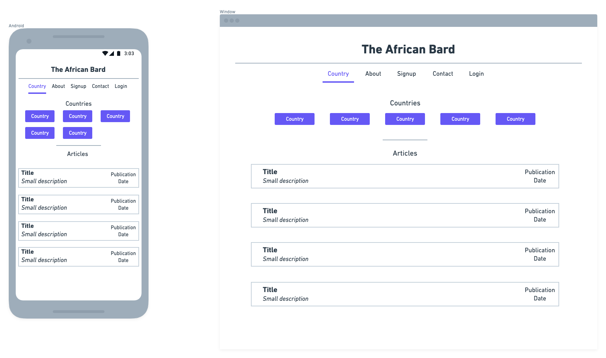
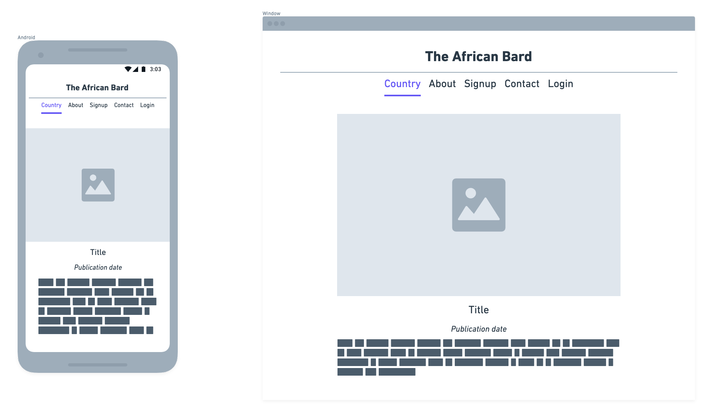
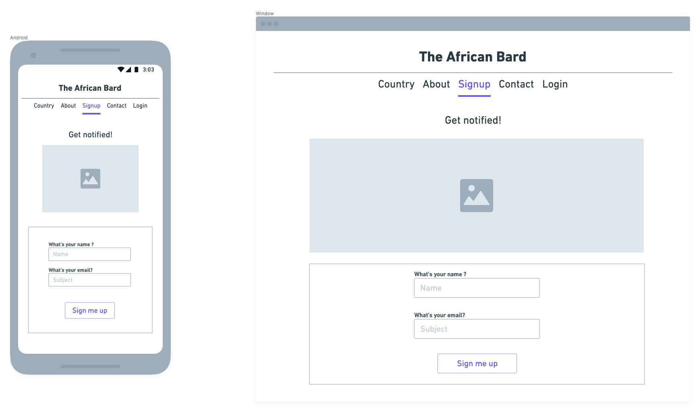

# Projet Travel Blog 

## Analyse préliminaire 

- une page web avec des articles de voyage 
- un administrateur qui peut se connecter 
- les visiteurs peuvent lire des articles 
- les visiteurs peuvent contacter l'auteur à l'aide d'un formulaire 
- l'administrateur peut ajouter un nouvel article
- un article possède une photo ou plusieurs photos
- un article possède un titre 
- un article possède une courte phrase détaillant un passage intéressant
- un article possède une description 
- un article possède une destination assignée 

- Bonus: un utilisateur peut acheter une photo dans la boutique en ligne

## User stories => Qu'est ce que ça fait

**Visiteur** : un utilisateur qui n'est pas connecté 
**Administrateur** : un utilisateur connecté 

|#|En tant que| j'ai besoin de | dans le but de|
|---|---|---|---|
|1|Visiteur|une page d'accueil|aller sur la page du choix de destinations|
|2|Visiteur|une page d'articles liée à une destination|choisir un article|
|4|Visiteur|une page article|lire un article|
|5|Visiteur|une page "À propos"|En savoir plus sur le projet|
|6|Visiteur|une page "Contactez-nous"|Laisser un message|
|7|Visiteur|une page "S'inscrire"|Demander à être notifié pour toute nouvelle publication|

|8|Admin|une page de connexion|pouvoir se connecter|
|9|Admin|interface admin|pouvoir ajouter un nouvel article|

## Wireframes => à quoi ça ressemble 

### page d'accueil

### page d'articles filtrés (par destination)

### page d'un article

**Bonus : Trouver un moyen de faire apparaître le nom du pays dans le menu**

### page "À propos" 

### page "S'inscrire"

### page "Contactez-nous"

### page de connection 

### page interface admin 

