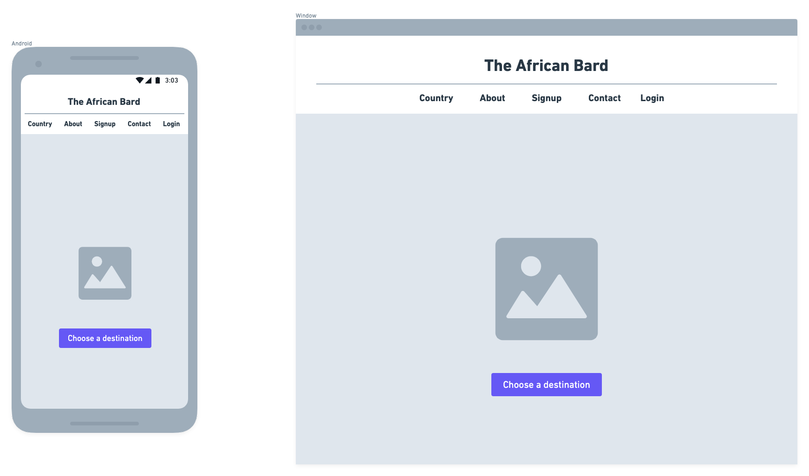
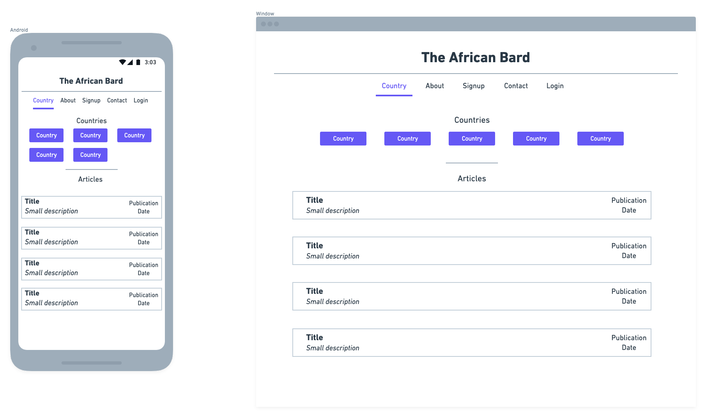
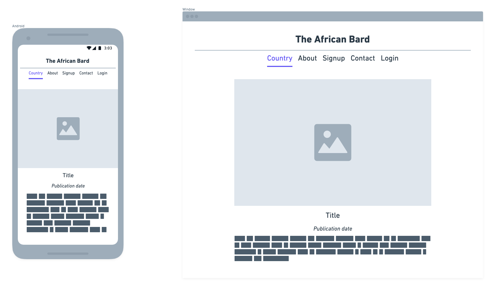
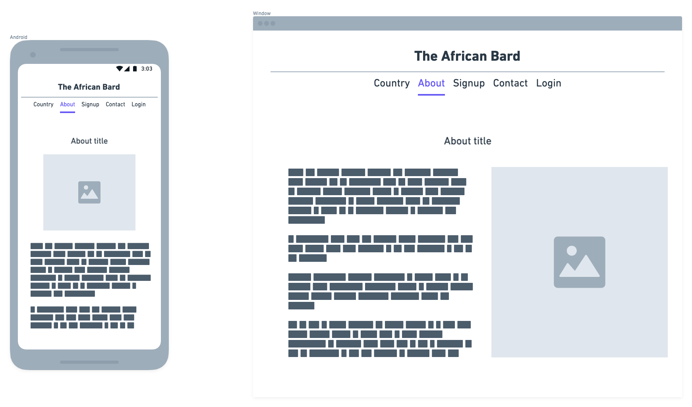
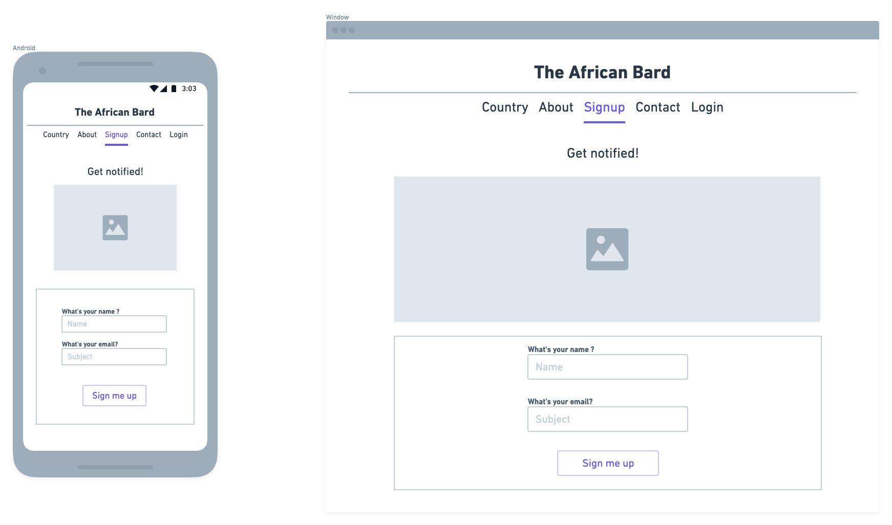
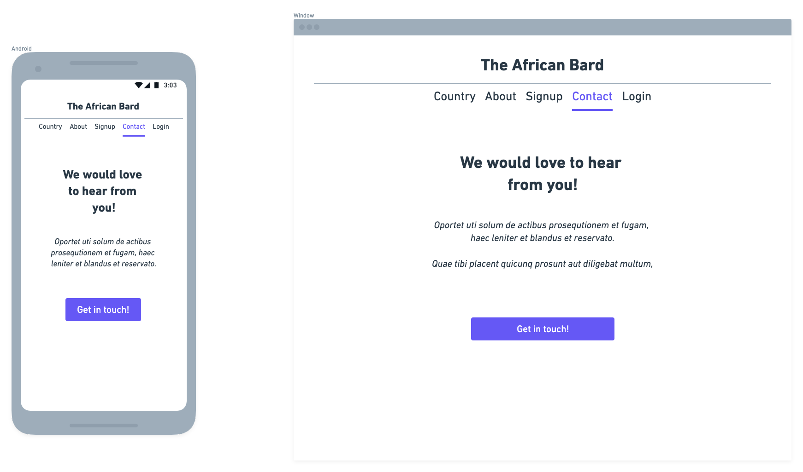
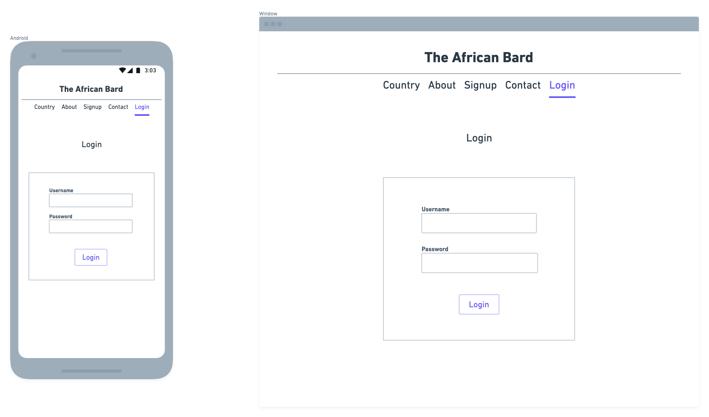
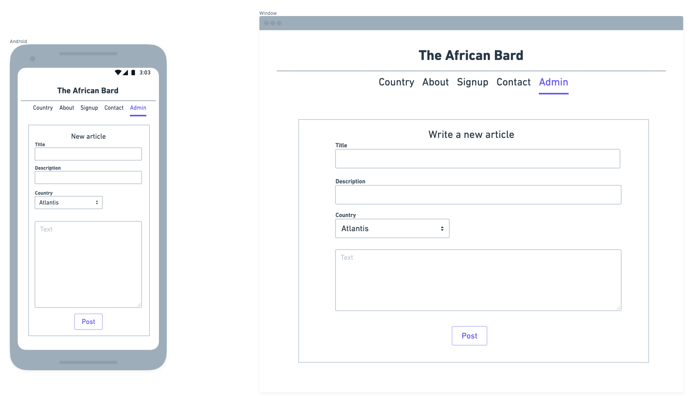

## Wireframes => à quoi ça ressemble 

### page d'accueil

### page d'articles filtrés (par destination)

### page d'un article

**Bonus : Trouver un moyen de faire apparaître le nom du pays dans le menu**

### page "À propos" 

### page "S'inscrire"

### page "Contactez-nous"

### page de connection 

### page interface admin 

